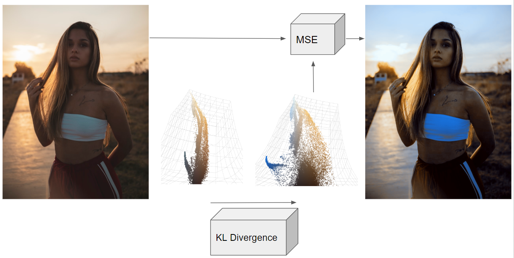

# Latent Space Color Fixes

  

This is the github pages writeup for the algorithm [described here](https://messy-bytes.github.io/Advanced-ML-Color-Fixes/) and [implemented here](https://github.com/messy-bytes/VAE-Color-Balance/tree/main).

## License

This project is licensed under the MIT License - see the [LICENSE](LICENSE) file for details.

