### [Author: John (Jack) Messerly](https://www.linkedin.com/in/jack-messerly-567b9b96/)

 
   

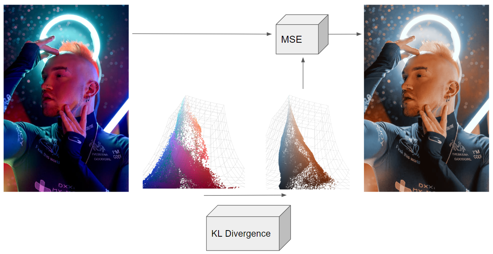

 
 

# About This Project

I created this ML algorithm during my spare time, initially to re-color old film photographs my dad took in Patagonia, which he captured with the  [Malefic 617 camera](https://www.maleficcameras.com/pagina-prodotto/malefic-m617). He forgot to get a color calibration measurement in the field, and the film roll got jammed, so the film became physically damaged in the development process. GIMP (free photoshop) was not enough to fix these photos, some of which are at the bottom of this page. I tried some basic ML color balancers available online, which directly regress new colors from bad ones, but they didn't give me the results I needed. I thought I'd have a crack at designing a better a better one, since I sit around and work on image processing problems all day anyway. What I came up with worked very well, even on color balance problems that are extremely difficult (with mixed lighting effects, or harsh post-processing filters), so I decided to write it up. Below is a sample result of fixing a damaged photograph of a street band taken in Puerto Natales, Chile. 

**More detailed introduction**: [I've added a detailed results gallery here](https://messy-bytes.github.io/Advanced-ML-Color-Fixes/2023/04/29/Introduction.html), which includes a lengthy introduction to basic computational photography, and how white balance assumptions are not enough to fix images with mixed or intense lighting distortions, as well as how to improve the colors of images with human faces.

 

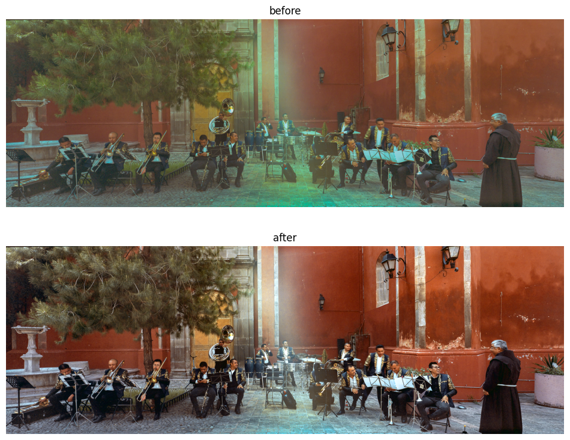

 
 

# I Want To Try It

[Here's a git repository](https://github.com/messy-bytes/Advanced-ML-Color-Fixes/tree/main/algorithm) with directions you can follow for trying this algorithm on your own images. It's a pretty straightforward, so you can mess around with the internals pretty easily as well. The network weights are large (but not large enough to motivate me to add them to a git LFS), so you have to recombine the .pth file with a bash script. There are instructions in there for that.

 
 

# How does it work

**It uses pre-trained VAEs**: The algorithm works by fixing images in the "latent space" of a pre-trained Variational Autoencoder (VAE). [I used the VAE that StabilityAI uploaded to HuggingFace, which is used in Stable Diffusion](https://huggingface.co/docs/diffusers/api/models/autoencoderkl). In simpler terms, a pre-trained network maps the images to very small representations, and all my color fixing happens in this smaller dimensional space. An "intermediate" network (that I trained) modifies these encodings into new encodings that can be decoded into prettier, "fixed" images. The architecture of this intermediate network is not very important (I made a Unet with some attention layers, which was overkill)1. It be noted that the decoded image from this process will have a small resolution and weird faces, so a second network is needed to map the color scheme it learned to the original high resolution image.

**There's a second network**: There's a second network (the MSE network) that learns a color mapping (old color -> new color) from the above input/output pair. Since this simpler network operates on single pixels, it can be applied to images of arbitrary resolution. Apply this network to the original high resolution image to get the final output.

**Review:**: This algorithm uses a VAE (which has both an encoder and decoder network), a latent color balancing network, and another network for representing a color map. A high resolution "distorted image" image (the one you want to fix) is cropped and compressed into a low resolution image (of dimension [224 x 224 x 3]) that StabilityAI's VAE can encode. We'll call this artifact the "distorted subimage", because it is cropped and will have terrible resolution. The VAE encodes this low resolution image as a [28 x 28 x 8] sized vector. We'll call this the "distorted encoding".

1. The first network (which was trained for this article) accepts as input this "distorted encoding", and outputs a "fixed encoding" (also of dimension [28 x 28 x 8]). The loss function for this network is KL divergence, because the encodings are technically the mean and variance of a gaussian distribution, although this isn't important for understanding the algorithm. This "fixed encoding" is decoded, using the VAE's decoder, to get back a prettier, albeit low resolution, new image of size [224 x 224 x 3]. We'll call this preliminary output the "fixed subimage".
2. A second network is trained to map the colors in the "distorted subimage" to the "fixed subimage", using MSE loss. Since this network maps colors (3 vectors) to new colors (3 vectors) it can be applied to images of arbitrary resolution. Apply it to the original, high resolution image to get a new high resolution image with "fixed" colors.

**What happens if I don't use a VAE**: A standard ML methodology for image enhancement is to train a CNN (convolutional neural network) to directly turn "bad pixels" into "balanced pixels". These networks look at thousands of "bad images", and their "corrected version", and learn to "fix" images through regression. This works pretty well, but on larger images, these networks take a very, very long time to train and are prone to catastrophic forgetting. There is also no guarantee that when they color in a new image, they will preserve all the edges and lines perfectly (after all, they are responsible for creating an entire new picture from scratch). These methods are also not agnostic to the target image resolution. If you do all your color fixing in the smaller dimensional space of the output of a Variational Autoencoder, you fix most of these problems. The "encoded" output of a VAE is small (the one I used has latent dimension of fixed size [28 x 28 x 8]), which speeds up training tremendously. The latent space is also enforced to be "regular", meaning that images with similar content are closer grouped together in this space, than they are in the original iamge space. I did not find that I needed any regularization strategies (like dropout or weight decay) when training a color balancer in the encoded space, but I did find that I needed them when training networks on the images directly.

**I'd like to learn more about VAEs**:  I did not provide a background section on Variational Autoencoders as explaining it from scratch would be difficult.One excellent article on this topic was written by Joseph Rocca and can be found on TowardsDataScience. It is worth mentioning that he was a full-time employee at the site when he wrote it. [The article is linked here](https://towardsdatascience.com/understanding-variational-autoencoders-vaes-f70510919f73)

 

1 *In Stable Diffusion art generation, this "intermediate" network doesn't just modify the colors of the image, but also the composition. You can view the algorithm on this page as an AI art algorithm that just modifies the colors.*

 
 

# Step-by-Step Illustration

## Step 1: compress / crop a full sized image a 224x224 sized tile 

The VAE for StableDiffusion actually requires images to be quite small ([224 x 224 x 3]), but this compression does not affect the final result due to our ability to remap the colors at full resolution with the MSE network (step 5-6).

  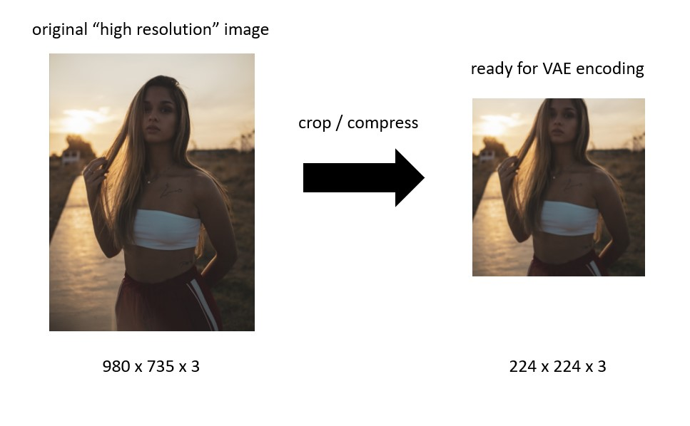

 

## Step 2: encode as a 28x28x8 sized distribution vector

The low resolution image is encoded with the pre-trained VAE's encoder. The "top four" [28 x 28] images are the mean of the latent representation, while the bottom four are the variance. In Stable Diffusion, this latent distribution is sampled to get randomized versions of the original image, but we aren't going to use the encoding like that. We are just going to plug it into another network as a [28 x 28 x 8] sized input vector.

  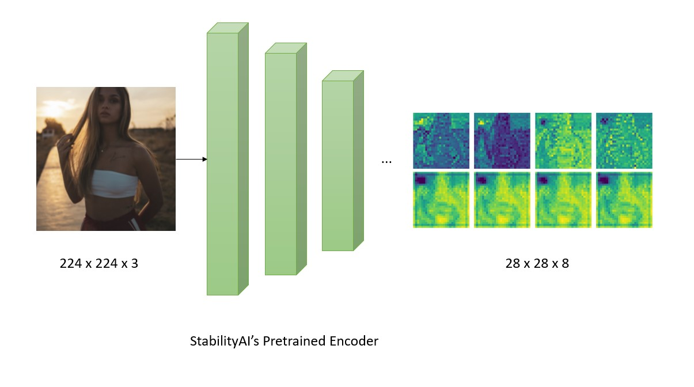

 

## Step 3: balance the encoding

The primary balancing network, trained with KL divergence, adjusts the encoding to be one that, in theory, should decode to a fixed image. The differences between the two encodings are interesting to ponder (why does the fixed encoding have higher variance values, and what do the channels mean in RGB space?). Ultimately, this encoding is uninterpretable, and we just have to treat it as data.

  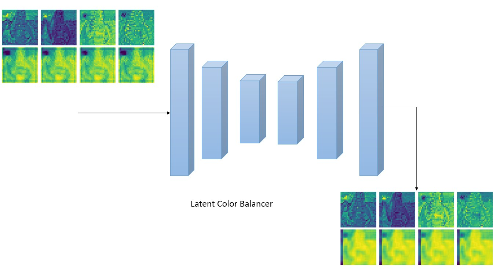

 

## Step 4: Decode to recover "balanced" and "distorted" 224x224 sized tiles

We decode both the distorted vector, and the fixed vector. Why not just the fixed? Notice how the face of the girl in these images looks wonky and weird. That is because Stable Diffusion's VAE does not decode details perfectly. We notice faces are often "off" in AI art because as humans, we are sensitive to facial distortions. Ultimately, we only care about the "color map" that can be learned between these two images. We decode a wonky "distorted" version of our image, so that we can line it up pixel-for-pixel with the "fixed" output. Then, we will train a new network (much simpler) to recolor images with this exact type of distortion.

  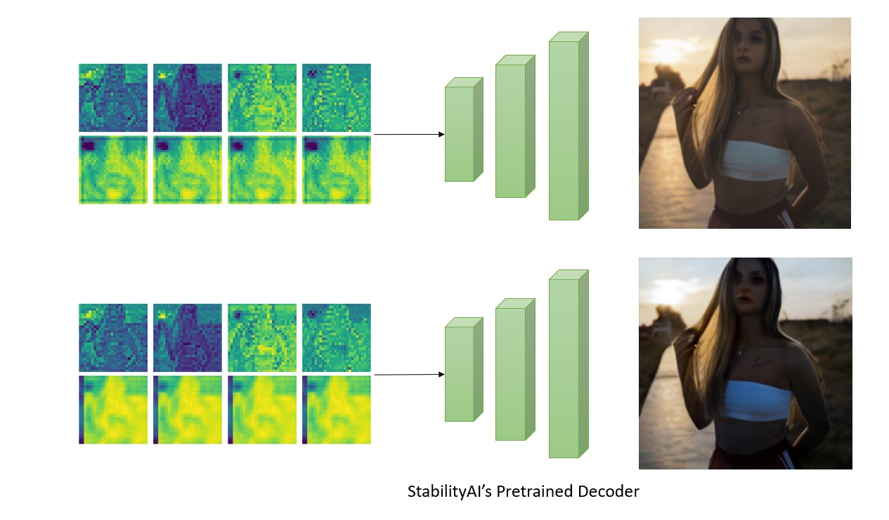

 

## Step 5: Train a new MLE classifier to map old colors to fixed colors

 

## Step 6: Apply this new MLE to the original, full resolution image

 

## Step N: Repeat as necessary

In the latent space, representations of the same subject matter with different colors are closely grouped, exhibiting regularity. This proximity implies that the algorithm maintains consistency and stability when repeatedly applied to the same image.

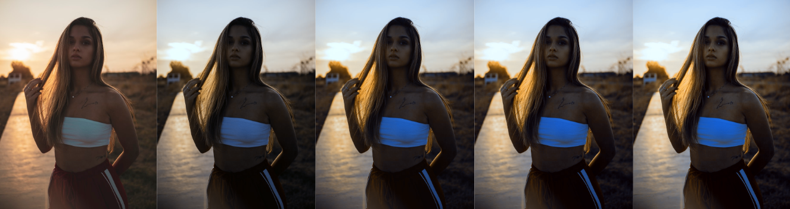

 
 

# What Data Was It Trained On

This was actually difficult. I went out of my way to make a custom color balance dataset specifically for these kinds of harsh problems. I made a sew of customized 1D LUT curves and 3D LUT cubes to mimic the distortions I thought were interesting. I have saved both the LUTs and the dataset for other engineers to use in the future. I would come back to this dataset if I wanted a new color balancer that does exactly what this one does, but is smaller than 100MB (I think this network was larger than it really needed to be). [A full guide on generating these datasets is here](https://messy-bytes.github.io/Advanced-ML-Color-Fixes/2023/05/03/Dataset-Curation.html).

 

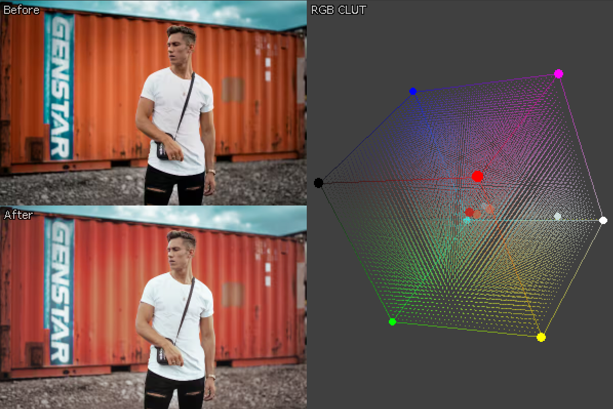

 
 
 

# Abstract

"Color balance" aims to enhance images with suboptimal color quality, typically resulting from colored ambient lighting, like the fluorescent lighting in a parking garage. The desired outcome in traditional color balancing is to replicate the colors that would be present under perfectly white light, a process known as "white balancing". However, the ideal color adjustment often depends on personal preference and psychological factors, leading modern techniques to extend beyond mere white balance to overall color enhancement. For instance, we generally prefer warmer tones in human faces, regardless of the actual lighting conditions.

The distinction between "color balance" and "image enhancement" can be vague. Data-driven machine learning methods address both simultaneously by adjusting the pixels of a poorly colored image to resemble those in more aesthetically pleasing references. A common machine learning approach involves using a fully convolutional network (FCN) to modify colors directly. This method, while effective, has limitations, such as potential loss of detail, inconsistent recoloring across similar areas, and slow training for large images.

However, powerful pre-trained varational autoencoders let you bypass these issues. By training a color balancer in Stable Diffusion's latent space, you can extract a color map (old color -> new color) to apply to your original images, which is far more efficient and effective than trying to train an AI to color each pixel in an image individually. Some advantages of using variational autoencoder representation's to achieve color balance: 

1. Protect edges and textures through simple color remapping.
2. Ensure uniform recoloring across the image, avoiding irregularities in similar areas.
3. Enhance efficiency and training speed due to the small, fixed-size latent representations, independent of the original image's resolution.

 
 

# HuggingFace's toolbox

Autoencoders (and variational autoencoder), are just data compression algorithms. They've become a hot topic recently because its been shown that a lot of AI art algorithms (including stable diffusion) can operate in the smaller compressed space. The VAE's trained by Stability AI that are available on HuggingFace compress images into small (28 x 28 x 28 x 8) vectors that can be easily stored and processed on servers and standard GPUs. The compressed space is more organized than the original, meaning that when these vectors are manipulated with other algorithms, the resulting images will be coherent. For example, a minor distortion in the compressed space will result in a hairstyle change in the original image space.

A big disadvantage of this scheme is that the "encoded representations" can't be decoded perfectly back into the originals. So while you can fuse together several picture of horses in a the "compressed" space, when you go and decode it, it will have weird ears and a distorted mouth. The "phase" of the image, a term I abuse here to describe the shape, structure and details, will be distorted. This is why AI art often contains "messed up faces". Below is an encoded and decoded image of a barista. Clearly, the decoded image is unusable. Also, the the fact that our VAE can only encode/decode small images (224 x 224) seems to negate its use in actual image enhancement pipelines.

 

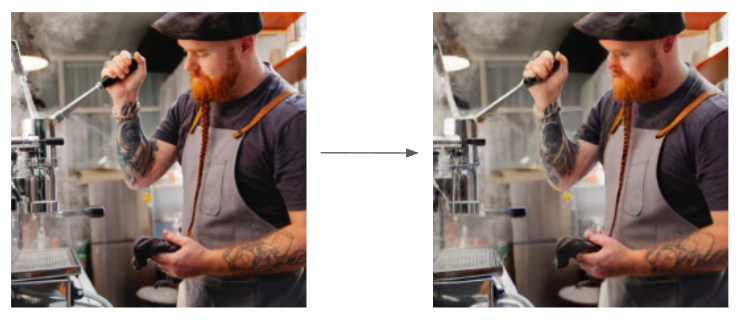

 

What if we only want to change the colors and lighting of our image instead of altering its "phase"? In the graphics and film industries, "Look Up Tables" are commonly used to adjust colors in images by mapping old colors to new ones. These tables are small in size (33 x 33 x 33 x 3) and can be applied to images of any resolution. You can follow this logic in reverse: if you want to learn a color and exposure mapping that "fixes" a high-resolution image, you shouldn't need to use the original full-sized image to obtain this mapping.                                    
 
 
 
     
# Project Structure

The goal of this (informal) post is to show how Stability AI's pre-trained VAEs can be used to re-color and re-light images more efficiently than current approaches. The post is divided into three parts for clarity.

 

## [Part 1: Results Gallery](https://messy-bytes.github.io/Advanced-ML-Color-Fixes/2023/04/29/Introduction.html)

"Colored lighting removal" is very similar to the concept of "white balance", but it is not the same thing. I've dedicated the first section to explaining the problem's scope, and demonstrating results in a small gallery. A lot of the images I focused on contain challenging color and lighting distortions that you generally won't see on other color balance articles. Some of this page is dedicated to explaining the general problem of color balance, but the writing does assume you are somewhat familiar with computational photography already.

 

## [Part 2: Dataset Curation](https://messy-bytes.github.io/Advanced-ML-Color-Fixes/2023/05/03/Dataset-Curation.html)

 

Dataset generation is its own large problem for tasks like this. This section covers dataset curation with 1D and 3D LUTs, and describes the limitations of generating a distortion dataset "randomly". It also includes a tutorial on how to create 3D LUTs using GIMP that can be applied to any image you like. There are probably radiometric and colorimetric distortions you'd like to be able to neutralize that aren't covered here, and learning how to build custom 3D LUTs is a good step forward for solving those problems.

 

## [Part 3: Denoising Algorithm Overview](https://messy-bytes.github.io/Advanced-ML-Color-Fixes/2023/05/05/The-Denoising-Algorithm.html)

This last section covers the actual machine learning involved, and the other parts of the denoising algorithm. Most of it is intuitive, but there seem to be some advantages of working in a latent space when it comes to "recursively applying" image filters. I've tried my best to explain why my technique works as well as it does when you apply it iteratively. This section assumes familiarity with Variational Autoencoders.

 
 

# Sample Results

 
 

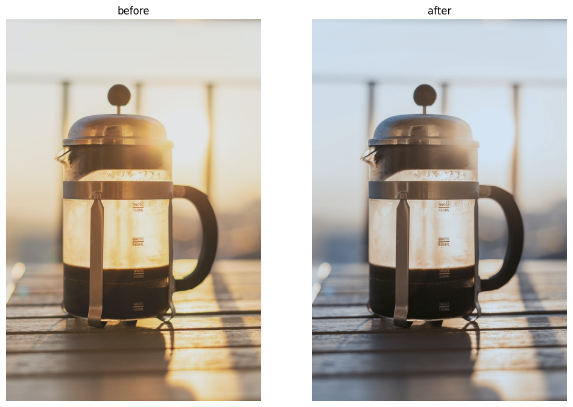

 
 

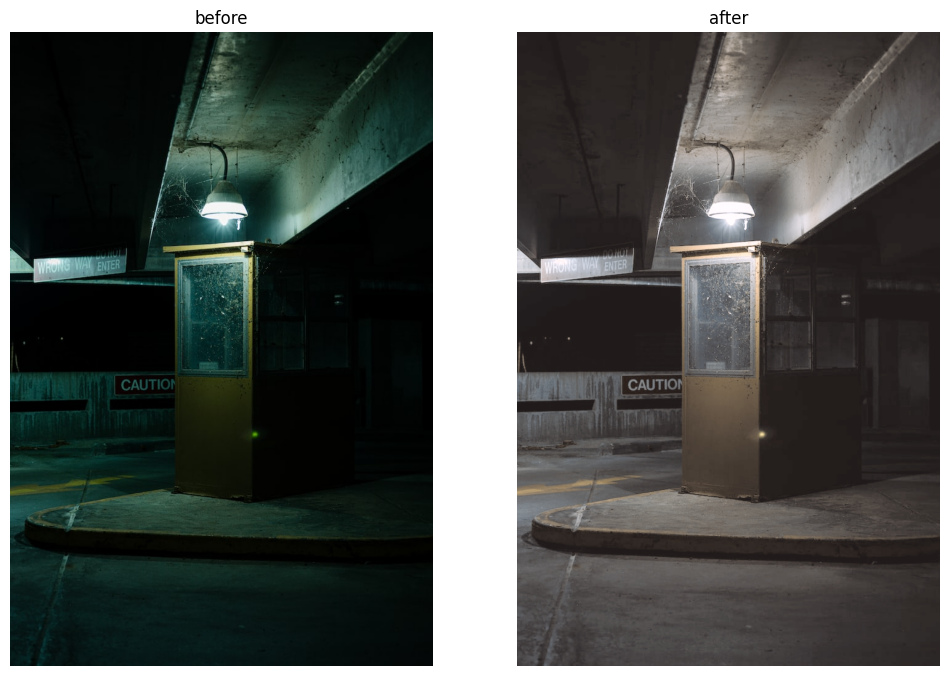

 
 

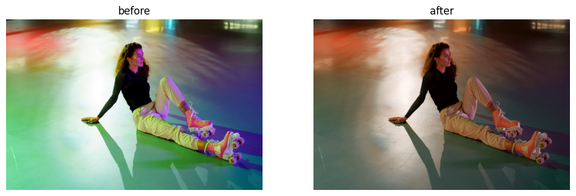

 
 

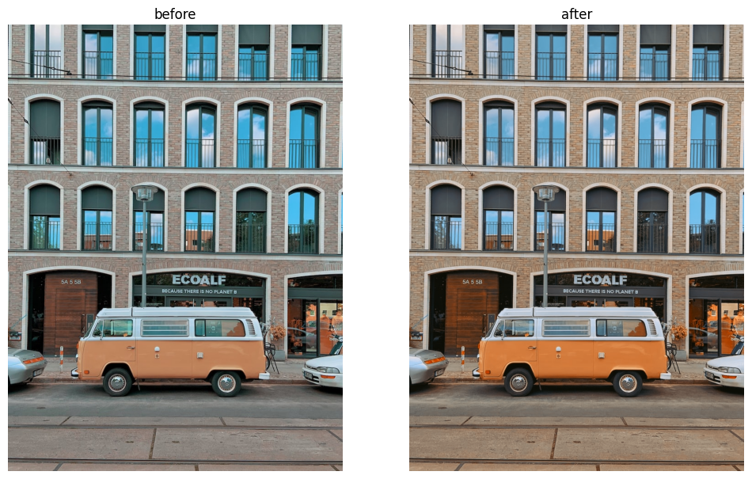

 
 

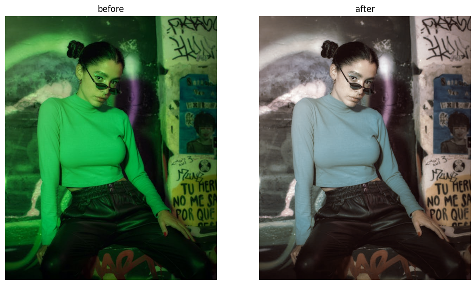

 
 

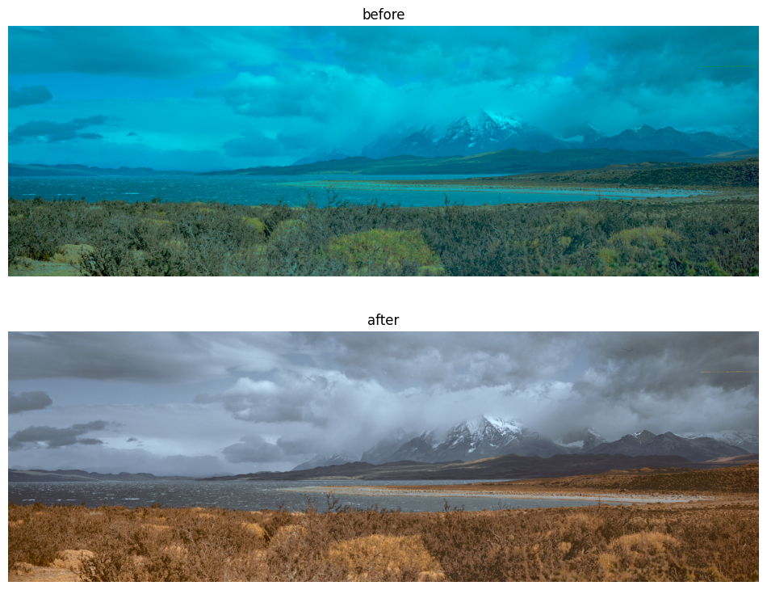

 
 

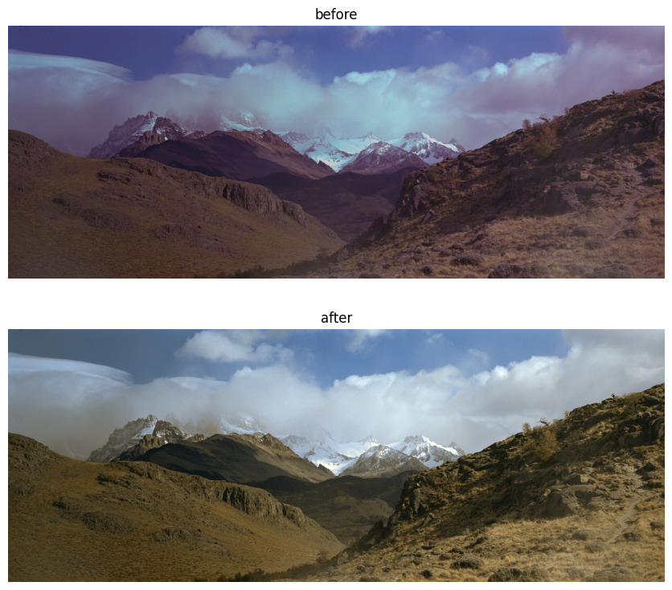

 
 

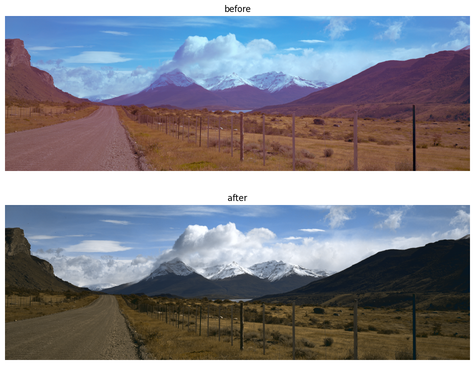
