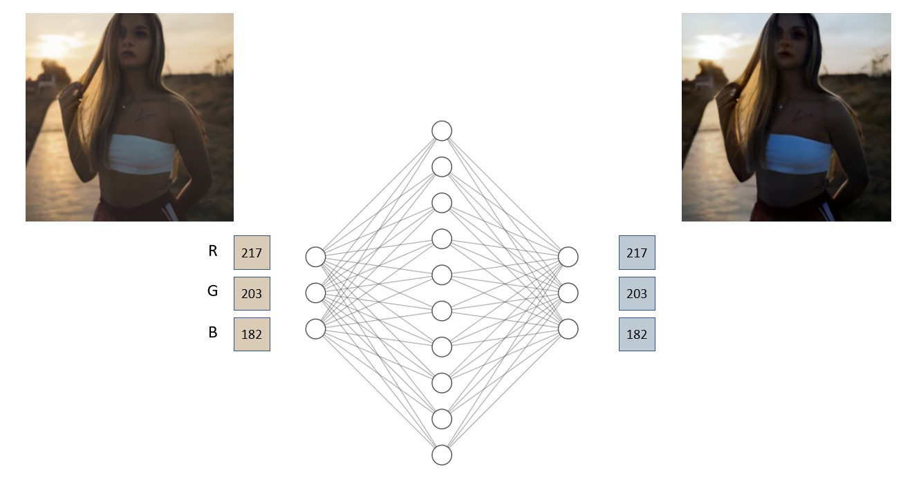
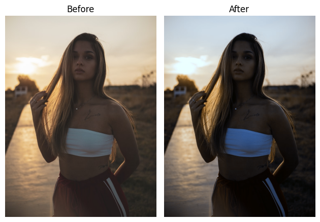
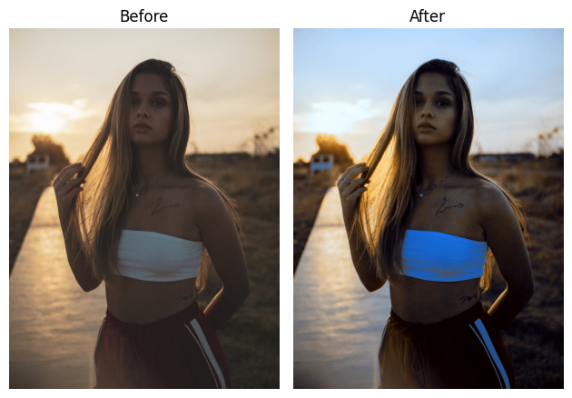
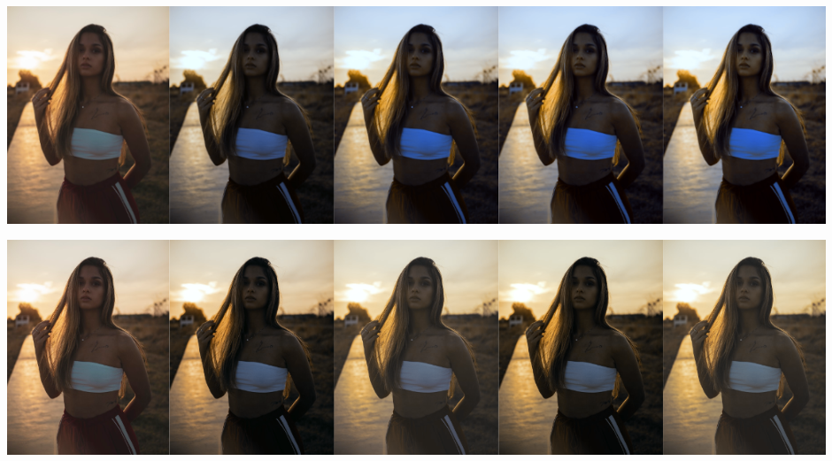

### [Author: John (Jack) Messerly](https://www.linkedin.com/in/jack-messerly-567b9b96/)
### [other sample work](https://jp-mess.github.io/blog-main/)
### [code](https://github.com/jp-mess/VAE-Color-Balance)

 
   

 
 

# About This Project

I created this ML algorithm in my spare time, initially to re-color old film photographs my dad took in Mexico, Chile and Argentina, which he captured with the  [Malefic 617 camera](https://www.maleficcameras.com/pagina-prodotto/malefic-m617). The camera isn't digital, so it doesn't have an auto white balance system, and to make matters worse, the film roll got jammed, so the photos were physically damaged before being developed. They also appear to have creases and chemical burns. GIMP (free photoshop) was not enough to fix these photos, some of which are at the bottom of this page. I tried some basic ML color balancers available online, which directly regress new colors from bad ones, but they didn't give me the results I needed. I thought I'd have a crack at designing a better one, since I sit around and work on image processing problems all day anyway. What I came up with worked very well, even on color balance problems that are extremely difficult (with mixed lighting effects, or harsh post-processing filters). The resulting pictures were very nice to look at, so I decided to write it up in a blog post. Below is a sample result of fixing a damaged photograph of a street band taken in Santiago de Queretaro. 

**More background info:** [I've added a detailed results gallery here](https://jp-mess.github.io/vae-color-article/2023/04/29/Introduction.html), which includes a lengthy introduction to basic computational photography, and a comparison of "easy" versus "difficult" lighting problems.
 
 

 
 

# I Want To Try It

[Here's a git repository](https://github.com/jp-mess/VAE-Color-Balance) with directions you can follow for trying this algorithm on your own images. It's pretty straightforward, but you need a linux terminal to use it, and the repository is fairly large (about 100MB) due to the size of the latent color balancing network.

 
 

# How does it work

The diagram at the top of the page shows two networks (the KL divergence trained network, and the MSE trained network). However, there are actually three networks involved here.

1. **The Variational Autoencoder (VAE):** Pre-trained by StabilityAI, [I just "stole" it from HuggingFace](https://huggingface.co/docs/diffusers/api/models/autoencoderkl). This network takes our original image into "the latent space", which really means it compresses it to a very small vector which magically captures the "essense" of the original image, such that it could be reasonably decoded with the VAE's decoder network. These small vectors can be interpreted as a mean/variance pair, but we aren't going to get that brainy here. One excellent article on this topic was written by Joseph Rocca and can be found on TowardsDataScience. It is worth mentioning that he was a full-time employee at the site when he wrote it. [The article is linked here](https://towardsdatascience.com/understanding-variational-autoencoders-vaes-f70510919f73)
2. **The Latent Balancer:** This network does most of it the work. It takes "encoded bad images" and turns them into "encoded good images". The architecture of this intermediate network is not very important (I made a FCN with some attention layers, which is often used for these applications). In theory, we could encode the image with the VAE, fix it with the latent balancer, decode it back into an image, and call it a day. However, the decoder's output is a small, ugly version of the original. It will have weird faces and blurry details. This is why StableDiffusion usually comes with an upsampler network. A second network is needed to map the colors to the high-resolution original image, which is trained online.
3. **The Color Mapper (upsampler):** We don't need an upsampler, because we only care about how the colors have changed. The second network is just a single layer MLP, trained with MSE, to map old colors to better ones from the above input/output pair. Since this simpler network operates on single pixels, it can be applied to images of arbitrary resolution. Apply this network to the original high-resolution image to get the final output.

 
 

# Step-by-Step Illustration

## Step 1: compress / crop a full sized image a 224x224 sized tile 

The VAE for StableDiffusion actually requires images to be quite small ([224 x 224 x 3]), but this compression does not affect the final result due to our ability to remap the colors at full resolution with the MSE network (step 5-6).

  

 

## Step 2: encode this image as a 28x28x8 sized distribution vector

The low-resolution image is encoded with the pre-trained VAE's encoder. The "top four" [28 x 28] images are the mean of the latent representation, while the bottom four are the variance. In Stable Diffusion, this latent distribution is sampled to get randomized versions of the original image, but we aren't going to use the encoding like that. We are just going to plug it into another network as a [28 x 28 x 8] sized input vector.

  

 

## Step 3: balance the encoding

The primary balancing network, trained with KL divergence, adjusts the encoding to be one that, in theory, should decode to a fixed image. The differences between the two encodings are interesting to ponder (why does the fixed encoding have higher variance values, and what do the channels mean in RGB space?). Ultimately, this encoding is uninterpretable, and we just have to treat it as data.

  

 

## Step 4: decode to recover a distorted/fixed pair

We decode both the distorted vector, and the fixed vector. Why not just the fixed and call it a day? Notice how the face of the girl in these images looks wonky and weird. That is because Stable Diffusion's VAE does not decode details perfectly. We notice faces are often "off" in AI art because as humans, we are sensitive to facial distortions. Ultimately, we only care about the "color map" that can be learned between these two images. We want to take the original distorted image, and line it up with the "fixed" one that we made with the balancer network, pixel for pixel, so we can figure out how to remap colors. We can't quite line up the cropped/compressed image from Step 1 with the "fixed" decoded output, because the image from step 1 does not have an "ugly face" that can be matched pixel-for-pixel with the fixed one. How do we get an "ugly face" version of the original image? Run the original encoding through the decoder as well.

  

 

## Step 5: train a new MSE classifier to map bad colors to good colors

This network is trained online, meaning that every time the algorithm runs, it needs to train a new color mapping network. However, a single layer MLP can be trained in a few seconds.

  

 

## Step 6: apply this map to the original, full resolution image

  

 

## Step N: repeat as necessary

In the latent space, representations of the same subject matter with different colors are closely grouped, exhibiting regularity. This proximity implies that the algorithm maintains consistency and stability when repeatedly applied to the same image.

  

 
 

# Analysis

**Do we really need the VAE?** Technically, no. You could skip the encoding / decoding steps, and train a FCN to balance the [224 x 224 x 3] sized images directly, and I did try this (using the same dataset). However, this comes with an obvious disadvantage (runtime), as well as a not-so-obvious disadvantage, which is lack of regularization. In this analysis section, I'll call the latent balancer the 28-Net, and the direct balancer the 244-Net. 

1. **Runtime + Memory:** Training a network to balance [28 x 28 x 8] sized encodings is easier than training a network to balance [224 x 224 x 3] sized images, because [28 x 28 x 8] is smaller than [244 x 244 x 3]. On the NVIDIA GeForce RTX 3070, the 28-Net could finish an epoch in 30 seconds, while the 224-Net required 220 seconds, a 7x slowdown. This is even considering that the 28-Net actually had more total parameters than the 224-Net, because the 224-Net needed to be trimmed so that it could run without being killed by the OS. The upsampling and downsampling to 224x224 dimensional image is just that expensive.

2. **Regularization:** StabilityAI put a lot of effort into training that VAE. The encoder's "latent space" was trained to be very regular, meaning that similar images in the encoded space are closer to each other than the images would be in the regular image space (in terms of image processing similarity metrics). This comes with a number of advantages for those that want to practice ML on the encodings. Firstly, I did not have to use any "regularization" strategies when training the 28-Net, like dropout or weight decay, whereas I did have to do this with the 224-Net. Secondly, the 28-Net seems to be more amenable to recursive application, i.e. when you apply it to an image multiple times, it is able to find nearby "improvements" very easily. This does not happen with the 224-Net, which bounces back-and-force between similar images. I presume this is because different colorings of these images are not close enough together in image space.

 

  

 
 

# What Dataset Did You Use?

I made my own. Actually, it was difficult to make a training dataset that could address the issues in my dad's damaged photos, and I think most of the hard work was done here. I made some Look Up Table (LUTs) to mimic a lot of complex distortions and gamma curves, and trained the latent balancer to remove them in the encoded space (by using the LUTs to distort the images, and then treat the original image as an output). [A full guide on generating these datasets is here](https://jp-mess.github.io/vae-color-article/2023/05/03/Dataset-Curation.html). I also took some "image enhancement" LUTs (from Kodak, Nikon and Colorist Factory), and used them to make training examples where the network could take normal images, and enhance them. This helped address the network's tendancy to output "dead-body" skin tones when the color neutralization was too strong. I think these extra examples overall made the output images look more visually appealing. Recall that of the 3 networks used (the VAE, the latent balancer, and the color mapper), only the latent balancer required offline training to recolor images.

 

 
 
 
 

# Torres del Paine Gallery

 

 
 

 
 

